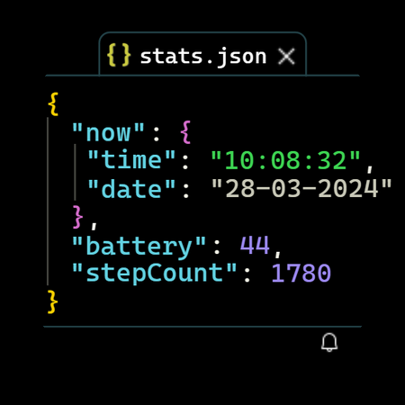
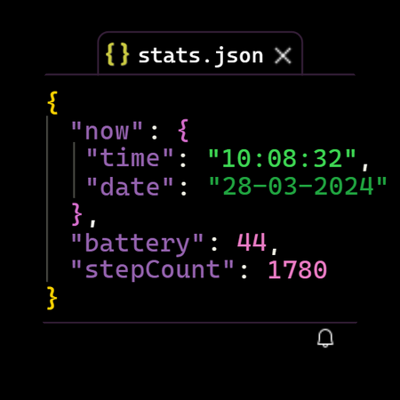
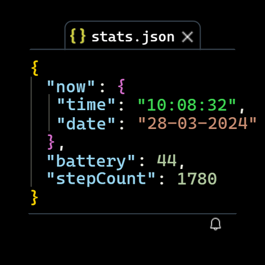

# Programmer Watchface
_Images may be out of date, I'll update them when the face goes into general availability._

## Available color schemes
_Themes are **inspired by**, not copies of ..._

  <table>
    <tr>
      <td>
        
      </td>
      <td>
        
      </td>
      <td>
        
      </td>
      <td>
        
      </td>
    </tr>
    <tr>
      <td>
        Monokai
      </td>
      <td>
        Abyss
      </td>
      <td>
        Dark+
      </td>
      <td>
        Kimbie
      </td>
    </tr>
  </table>

**If you want access**
- send me a DM on reddit: [u/jonathanbout](https://www.reddit.com/user/JonathanBout/)

# Releases

## v0.4.0
- 4 color options (all the dark variants):
  - Monokai
  - Abyss
  - Dark+
  - Kimbie
- Tab title color changes based on events in this order:
  - Battery < 20%: red
  - Notification count > 0: green
  - Default: white-ish
- Move complications into a status bar

## v0.3.0
- Tab bar lines

## v0.2.0
- Increase font size
- Change background to solid black for better battery performance with AMOLED screens

## v0.1.1
Initial release for GitHub
