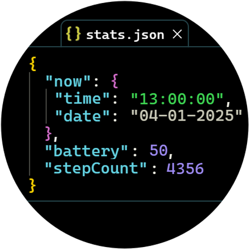

# Programmer Watchface
_Images may be out of date, I'll update them when the face goes into general availability._

**If you want access**
- send me a DM on reddit: [u/jonathanbout](https://www.reddit.com/user/JonathanBout/)

# Releases

## v0.3.0
- Tab bar lines

## v0.2.0
- Increase font size
- Change background to solid black for better battery performance with AMOLED screens

## v0.1.1
Initial release for GitHub
